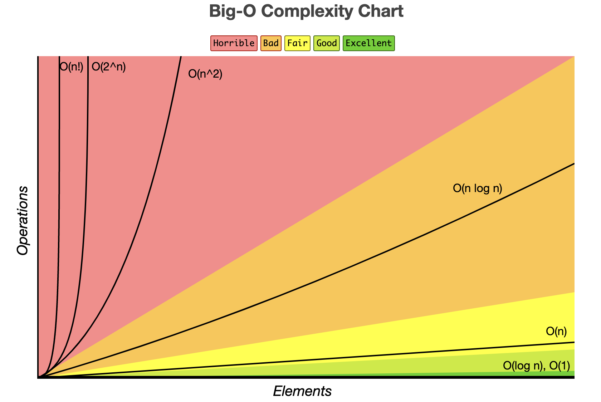

# Tech Interview Cheatsheet

## Time complexities of different data structures

| Data Structure | Insertion | Deletion | Indexing | Search | Optimized Search |
|:--------------:|:---------:|:--------:|:--------:|:------:|:----------------:|
|     Array      |   O(n)    |   O(n)   |   O(1)   |  O(n)  |     O(log n)     |
|                |           |          |          |        |                  |
|                |           |          |          |        |                  |

## Time and space complexity of searching and sorting

|   Algorithm    | Best Time Complexity | Average Time Complexity | Worst Time Complexity  | Worst Space Complexity |
|:--------------:|:--------------------:|:-----------------------:|:----------------------:|:----------------------:|
| Linear search  |         O(1)         |          O(n)           |          O(n)          |          O(1)          |
| Binary search  |         O(1)         |        O(log n)         |        O(log n)        |          O(1)          |
|                |                      |                         |                        |                        |
|  Bubble sort   |         O(n)         |    O(n2)     |    O(n2)    |          O(1)          |
| Selection sort |   O(n2)   |    O(n2)     |    O(n2)    |          O(1)          |
| Insertion sort |         O(n)         |    O(n2)     |    O(n2)    |          O(1)          |
|   Merge sort   |       O(nlogn)       |        O(nlogn)         |        O(nlogn)        |          O(n)          |
|   Quick sort   |       O(nlogn)       |        O(nlogn)         |    O(n2)    |        O(log n)        |
|   Heap sort    |       O(nlogn)       |        O(nlogn)         |        O(nlogn)        |          O(n)          |
|  Bucket sort   |        O(n+k)        |         O(n+k)          |    O(n2)    |          O(n)          |
|   Radix sort   |        O(nk)         |          O(nk)          |         O(nk)          |         O(n+k)         |
|    Tim sort    |         O(n)         |        O(nlogn)         |        O(nlogn)        |          O(n)          |
|   Shell sort   |         O(n)         |  O((nlogn)2  | O((nlogn)2  |          O(1)          |

## Searching
### Binary Search
1. Binary Search is a searching algorithm used in a sorted array by repeatedly dividing the search interval in half.
2. Conditions for applying binary search: 
   1. The arrays or f(x) should be monotonic in nature.
3. Formula to find the mid element:
   1. mid = l + ((r - l) / 2)
4. Time complexity: O(log n)

